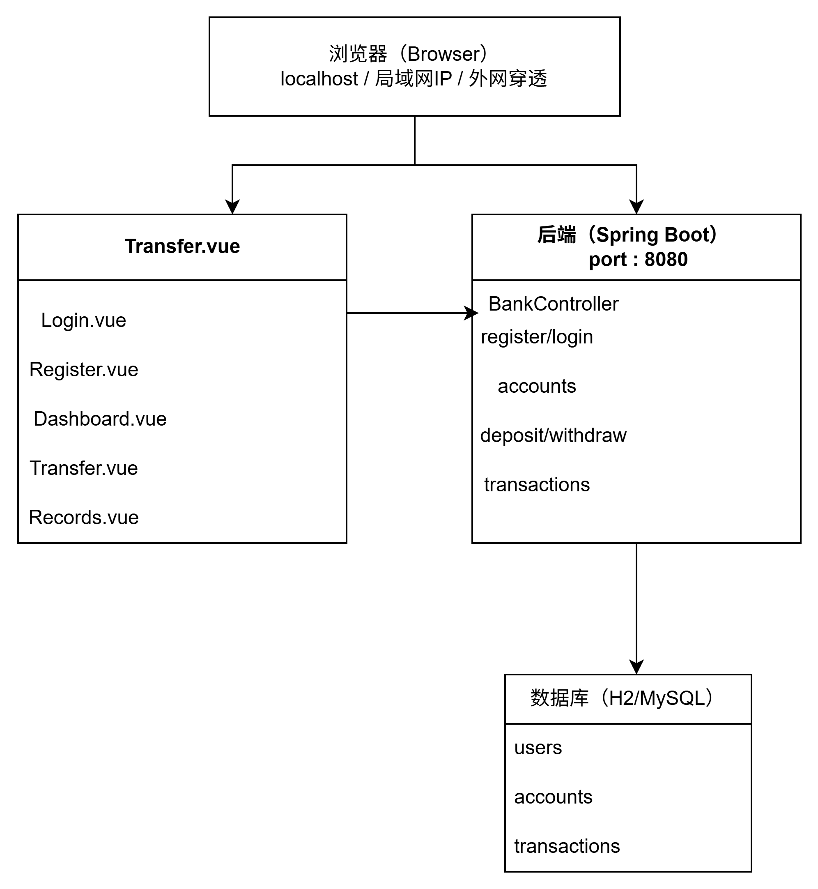
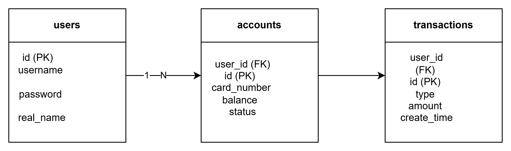
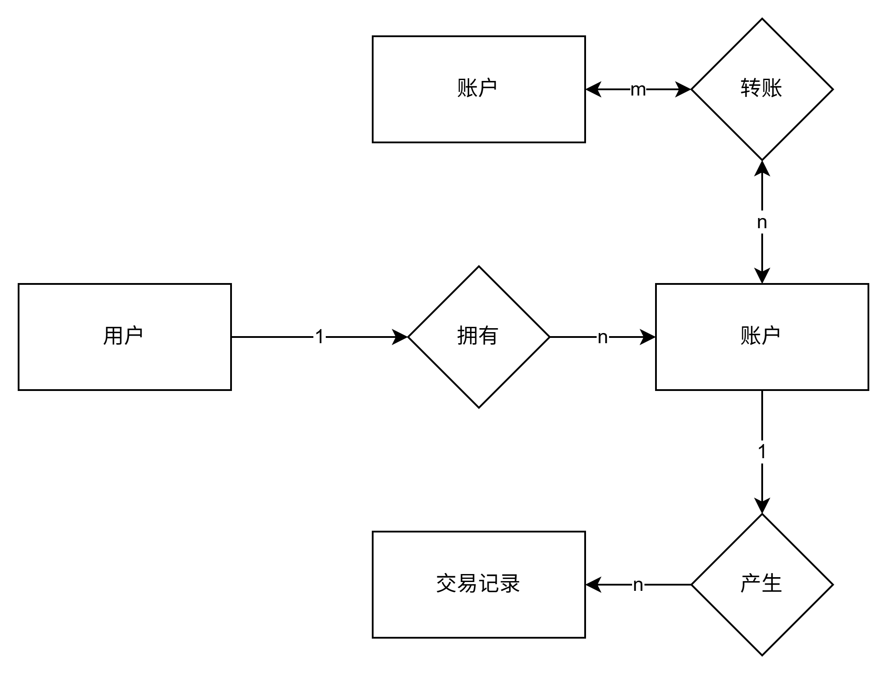
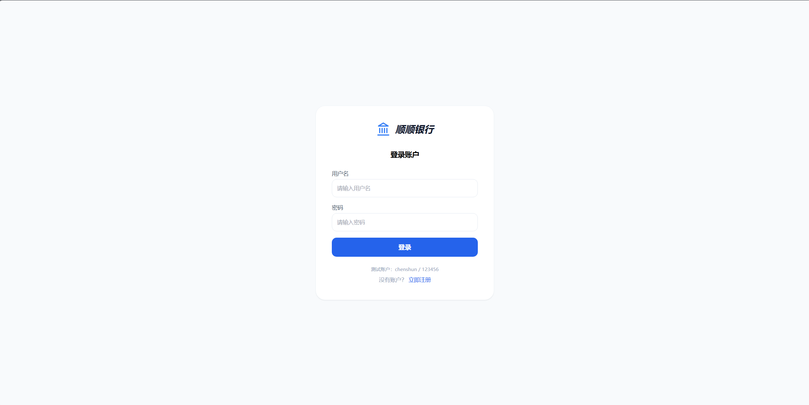
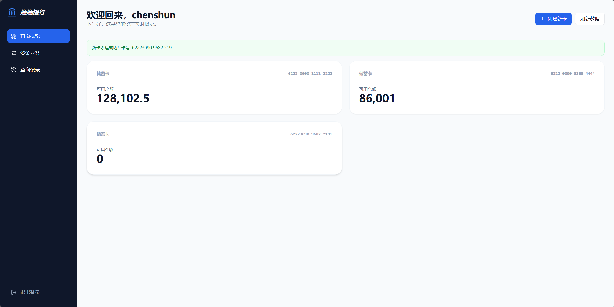
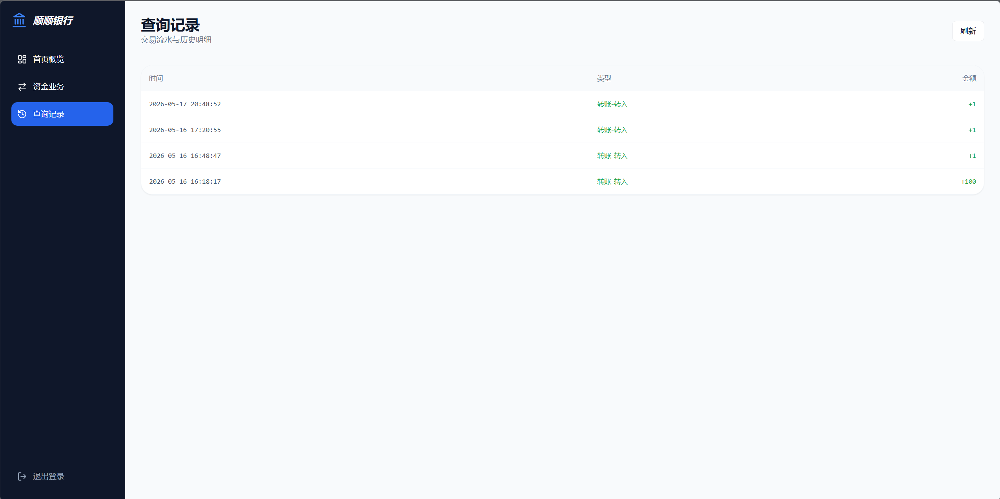

# 软件说明书（中期 / 结项共用主文档）

> 使用说明 
> - 本文档作为**中期检查**与**最终软件说明书**的共用主文档。  
> - **中期阶段**：先完成标注为“中期必填”的内容；标注为“结项补全”的内容可暂留空。  
> - **结项阶段**：在中期版本基础上继续补全，整理后导出为最终doc/docx。  
> - 过程性图片请单独存放在`assets/`目录，正文中使用相对路径引用。  
> - 过程考核以Git中的md增量记录为主，最终排版稿以导出的doc/docx为准。  

---

## 基本信息

**项目名称：**银行账户管理系统  
**学    院：** 计算机学院  
**小组序号：**20  
**成员姓名：** 陈顺、周俊豪、冯浩宇
**指导老师：** 尹兆远  
**当前版本：** 中期版 
**更新日期：** 2026年5月2日  

---

## 一、项目概述  【中期必填】

### 1. 项目背景
在日常银行业务办理中，账户开户、存取款、转账、查询、挂失等操作频繁，传统人工管理存在效率低、易出错、数据难以统一管理、安全性不足等问题。
为实现账户业务流程标准化、数据信息化、操作可追溯，同时满足课程实践与综合编程能力训练需求，开发一套简洁实用的银行账户管理系统，实现对个人账户的基本业务信息化管理，具有较强的学习与实践意义。
### 2. 系统目标
（1） 项目目标
① 实现用户开户、登录、密码修改、信息查询等基础账户管理功能。
② 完成存款、取款、转账、余额查询、交易记录查看等核心资金业务。
③ 实现账户挂失、解冻、销户等辅助管理功能。
④  保证系统操作简单、运行稳定、数据安全可追溯。
完成从需求、设计、编码到测试、文档的完整软件开发流程训练
（2）预期效果：
① 架构建立：确立了 Vue 3 + Spring Boot + MySQL 前后端分离架构，并完成 Git 仓库初始化
② 地基筑牢：设计了包含用户、账户及交易流水的数据库表结构，满足金额精度与安全性要求
③ 雏形可见：前端实现了交互原型（首页、转账、管理页），后端定义了核心业务 API 契约。
④ 进度同步：成员分工明确，已准备好进入下一阶段核心功能开发。
### 3. 开发环境
① 开发工具：
IDE (集成开发环境)：IntelliJ IDEA 或 VS Code。
版本控制：GitHub (仓库名：haohaobuchixiangcai)。
② 运行环境：
后端环境：JDK 运行环境（支持 Java 开发）。
③ 数据库：
数据库系统：MySQL
核心表设计：用户信息表、账户信息表、交易流水表、系统操作日志表。

## 二、需求分析  【中期必填】

### 1. 功能需求
用户模块：注册开户、登录验证、密码修改、个人信息管理
资金业务：存款、取款、转账、余额实时更新
查询模块：交易记录查询、明细展示、按时间筛选
管理模块：账户信息管理、流水查看、简单统计
安全模块：操作日志记录、异常操作提示
### 2. 非功能需求
性能要求：操作响应迅速，支持多人同时在线使用
安全要求：密码安全存储，重要操作需验证身份
兼容性要求：可在常见 Windows 环境下稳定运行，部署简单
> 中期要求：功能清单、主要业务流程、基本非功能需求应明确。  
> 结项要求：与最终实现保持一致，删除未完成但未说明的内容。  

---

## 三、系统设计  【中期必填】

### 1. 系统架构
（说明系统总体架构并附架构图）
（1） 系统架构
采用前后端分离架构，旨在确保系统的稳定性、高效性和可维护性 。
① 前端 (Vue 3)：负责页面展示与用户交互，通过 HTTP/REST API 向后端发起数据请求
② 后端 (Spring Boot)：负责处理核心业务逻辑、权限控制及接口服务 。 
③ 数据库 (MySQL)：负责所有业务数据的持久化存储 。 
（2） 系统架构图：
      
                                                             
### 2. 模块设计
（说明主要模块及其职责关系）
系统划分为四个主要模块，各模块职责明确且相互配合 ：
① 用户管理模块：负责用户注册开户、登录验证（JWT）、密码修改及个人信息维护 。
② 核心资金业务模块：处理存款、取款及转账业务 。该模块是系统的核心，转账操作需严格保证转出与转入的原子性（数据库事务控制）。
③ 查询记录模块：提供账户余额的实时展示以及历史交易流水的查询与分页显示 。
### 3. 数据库设计
- E-R 图
- 主要数据表设计
(1) E-R 图

用户 1 : N 账户   账户 1 : N 交易记录



(2)主要数据表设计
1. users（用户表）
字段	类型	约束	说明
id	INT	PRIMARY KEY, AUTO_INCREMENT	用户 ID
username	VARCHAR(255)	UNIQUE, NOT NULL	登录用户名
password	VARCHAR(255)	NOT NULL	登录密码
real_name	VARCHAR(255)	—	真实姓名
2. accounts（账户表）
字段	类型	约束	说明
id	BIGINT	PRIMARY KEY, AUTO_INCREMENT	账户 ID
user_id	BIGINT	FOREIGN KEY $\rightarrow$ users.id	所属用户
card_number	VARCHAR(255)	—	银行卡号
balance	DECIMAL(38,2)	DEFAULT 0.00	账户余额
status	VARCHAR(50)	DEFAULT 'ACTIVE'	状态 (ACTIVE/FROZEN)
3. transactions（交易记录表）
字段	类型	约束	说明
id	BIGINT	PRIMARY KEY, AUTO_INCREMENT	记录 ID
user_id	BIGINT	FOREIGN KEY $\rightarrow$ users.id	所属用户
type	VARCHAR(50)	—	存钱 / 取钱 / 转账-转入 / 转账-转出
amount	DECIMAL(38,2)	—	金额 (正=入账, 负=出账)
create_time	DATETIME	DEFAULT CURRENT_TIMESTAMP	交易时间
 


> 中期要求：架构、模块、数据库设计基本定稿。  
> 结项要求：与最终系统一致，如有调整需同步更新。  

---

## 四、系统实现  【中期部分填写；结项补全】

### 1. 关键技术
（说明使用的核心算法、框架或技术难点解决方案）
本项目采用了前后端分离的开发模式，核心技术选型如下：
①前端:
前端使用 Vue Router 的 beforeEach 路由守卫拦截页面跳转，未登录用户自动重定向到登录页。开发阶段通过 Vite 代理将 /api 请求转发到后端 localhost:8080，避免跨域问题且无需写完整 URL。配置 host: 0.0.0.0 使同网络下其他设备可直接访问前端页面。
② 后端:
使用 @Transactional 保证转账操作原子性，BigDecimal 保证金额精度，WebConfig 全局 CORS 配置解决跨域。
③数据库
数据库使用 JPA 的 @Entity、@Table 注解将 Java 对象自动映射到数据库表，配合 ddl-auto: update 实现启动时自动建表和更新表结构。开发环境采用 H2 文件数据库，无需安装 MySQL，数据持久化到本地文件，重启不丢失，切换生产环境仅需修改一行配置。

### 2. 界面展示
（提供主要功能界面截图并配文字说明）
1. 用户登录界面
本界面为顺顺银行系统的登录入口，用户可通过输入用户名和密码完成身份验证。界面提供测试账号，同时设有 “立即注册” 入口，方便新用户开户。

2.系统首页界面
该界面为用户登录后的首页概览，展示用户名下所有储蓄卡的账户余额与卡号信息，支持创建新账户、刷新数据，并通过左侧导航栏快速跳转资金业务、查询记录等功能模块。

3 账户创建功能界面
该界面展示用户成功创建新储蓄卡后的效果，系统实时新增账户卡片并提示新卡号，支持多账户统一管理与数据刷新。

4. 资金业务界面
这是系统的核心操作模块，集成了转账、存款与取款功能。用户只需填写简单的表单（如收款账号和金额）即可发起转账请求；页面设计模拟了真实银行的快捷业务流程，确保用户在进行资金划拨时操作流畅且逻辑清晰。

5. 查询记录界面
该页面负责提供详尽的数据审计服务，展示了账户内所有历史交易的流水清单。每笔记录都包含交易摘要、分类、时间及最终状态（如已完成或处理中），并支持用户根据业务类型进行筛选，确保每一分钱的去向都安全可追溯。

### 3. 核心代码片段
（展示关键功能的代码并注释，例如数据库连接、核心算法）
1. 转账接口（核心业务）
@PostMapping("/accounts/transfer")
@Transactional  // 事务：任何一步失败则全部回滚
public Map<String, Object> transfer(@RequestBody Map<String, Object> body) {
    Account fromAcc = accountRepository.findByCardNumber( body.get("fromCardNumber")).orElse(null);
    Account toAcc   = accountRepository.findByCardNumber( body.get("toCardNumber")).orElse(null);

    if (fromAcc == null || toAcc == null) return error("账户不存在");
    if (fromAcc.getBalance().compareTo(amount) < 0) return error("余额不足");

    // 扣款 + 入账（BigDecimal 保证精度）
    fromAcc.setBalance(fromAcc.getBalance().subtract(amount));
    toAcc.setBalance(toAcc.getBalance().add(amount));

    // 记录双方流水
    transactionRepository.save(new Transaction(fromAcc.getUserId(), "转账-转出", amount.negate()));
    transactionRepository.save(new Transaction(toAcc.getUserId(), "转账-转入", amount));

    return success(fromAcc.getBalance());
}
2. 路由守卫
router.beforeEach((to, from, next) => {
    const loggedIn = localStorage.getItem('userId');
    if (to.meta.requiresAuth && !loggedIn) next('/login');  // 未登录跳转
    else next();                                             // 放行
});
3. 数据库连接配置
# 文件：application.yml

spring:
  datasource:
    # H2 文件数据库：数据持久化，重启不丢失
    url: jdbc:h2:file:./data/bank_db;DB_CLOSE_DELAY=-1;MODE=MySQL
    username: sa
    password:
    driver-class-name: org.h2.Driver

  jpa:
    hibernate:
      ddl-auto: update    # 自动建表/更新表结构
    show-sql: true        # 控制台输出 SQL，方便调试

server:
  port: 8080
4. 跨域解决
// 后端 WebConfig.java
registry.addMapping("/**")
    .allowedOriginPatterns("*")        // 允许所有来源
    .allowCredentials(true);
// 前端 vite.config.js
server: {
    host: '0.0.0.0',                   // 允许局域网访问
    proxy: { '/api': 'http://127.0.0.1:8080' }  // 代理转发
}

> 中期要求：  
> - 可先填写已确定的关键技术；  
> - 可展示已完成页面或原型图；  
> - 核心代码片段可暂不完整。  
>
> 结项要求：  
> - 补全最终关键技术说明；  
> - 使用真实系统界面截图替换原型图；  
> - 展示关键功能的代码片段。  

---

## 五、系统测试  【中期先写方案；结项补全结果】

### 1. 测试方案
（简述测试方法和测试范围）
(1) 测试方法
① 黑盒测试（主要）：在不考虑内部结构的情况下，测试系统的每一个功能模块是否能按照需求完成开户、存取、转账等操作 。
② 白盒测试（部分）：针对后端核心逻辑（如资金划拨算法）进行逻辑覆盖测试，确保代码分支运行正确。
③ 接口测试：使用 Postman 工具对后端 RESTful API 进行调用，验证 JSON 数据传输的准确性 
(2) 测试范围
① 功能测试：涵盖用户管理、核心资金业务、查询记录及系统管理四大模块 。
② 安全性测试：验证密码加密存储、非法越权访问（如用户 A 尝试操作用户 B 的账户） 。 
③ 一致性测试：模拟转账过程中的意外断电或网络中断，验证数据库事务回滚是否能保证资金不丢失、不重复 。

### 2. 测试结果
（展示主要测试用例及结果）
1. 登录注册模块
用例	操作	预期	结果
正确登录	输入 chenshun / 123456	跳转首页，显示用户名	通过
错误密码	输入错误密码	提示 "账号或密码错误"	通过
空字段校验	用户名或密码留空	提示 "请输入用户名和密码"	通过
注册新用户	填写用户名和密码	创建成功，显示卡号，余额 0	通过
重复注册	用户名已存在	提示 "用户名已存在"	通过
2. 账户管理模块
用例	操作	预期	结果
查看账户	登录后进入首页	显示所有银行卡及余额	通过
创建新卡	点击 "创建新卡"	生成新卡号，初始余额 0	通过
刷新数据	点击 "刷新数据"	页面数据重新加载	通过
3. 资金操作模块
用例	操作	预期	结果
存款	选择账户，输入金额 5000	余额增加 5000，生成流水	通过
取款（余额充足）	输入金额 1000	余额减少 1000，生成流水	通过
取款（余额不足）	输入金额超过余额	提示 "余额不足"	通过
转账（正常）	跨卡转账 2000	双方余额正确变动	通过
转账（给自己）	收款卡号填自己的卡	提示 "不能转账给自己"	通过
金额校验	输入负数或 0	提示 "请输入有效的金额"	通过
4. 交易记录模块
用例	操作	预期	结果
查看记录	点击 "查询记录"	按时间倒序显示所有交易	通过
交易类型	执行存取款转账后查看	正确显示转入/转出/存钱/取钱	通过
空记录	新注册用户查看	显示 "暂无交易记录"	通过

测试结果截图:

### 3. 问题与改进
（说明发现的问题及改进措施）
问题一：MySQL 依赖导致启动失败 初次启动时后端配置了 MySQL，但本地未安装数据库，应用启动直接报错退出。
改进措施：切换为 H2 文件数据库，无需任何安装即可运行，同时保留 MySQL 配置方式，生产环境修改一行即可切换。
问题二：多卡用户查询异常 一个用户拥有多张银行卡时，AccountRepository.findByUserId 返回单个对象导致 JPA 抛出 "2 results were returned" 异常。
改进措施：将返回值改为 List<Account>，调用方取第一条或遍历全部。
问题三：外网无法访问 开发阶段 localhost:5173 仅本机可达，其他成员无法协作用户测试。
改进措施：前端配置 host: 0.0.0.0 支持局域网访问，配合 SSH 隧道实现外网穿透。

> 中期要求：  
> - 先写测试计划、测试范围、测试思路；  
> - 可列出准备执行的测试用例。  
>
> 结项要求：  
> - 补全真实测试结果；  
> - 记录主要问题及修正情况。  

---

## 六、用户手册  【结项补全】

### 1. 安装部署说明
（说明环境配置与部署步骤）
环境要求
Java 17+、Node.js 18+
部署步骤
# 1. 克隆项目
git clone https://github.com/qweasd14115/haohaobuchixiangcai.git
cd bank-system

# 2. 启动后端（终端1）
cd bank-backend
.\mvnw spring-boot:run
# 看到 "Started BankBackendApplication" 即启动成功

# 3. 启动前端（终端2）
cd frontend
npm install
npm run dev
# 看到 "http://localhost:5173" 即启动成功
浏览器打开 http://localhost:5173 即可使用。

### 2. 操作指南
（说明系统主要功能的使用方法）
注册 点击登录页下方"立即注册"，填写用户名和密码，系统自动分配一张银行卡，初始余额为 0。
登录 输入注册的用户名和密码，也可使用测试账号 chenshun / 123456。
首页概览 登录后显示所有银行卡及余额。点击"创建新卡"可申请新银行卡，点击"刷新数据"重新加载账户信息。
资金业务 页面顶部三个标签切换功能：转账汇款（选择付款账户、输入收款卡号、金额）、存款充值（选择账户、输入金额）、取款提现（选择账户、输入金额，余额不足会提示）。
查询记录 按时间倒序列出所有交易流水，包含交易时间、类型（存钱/取钱/转账-转入/转账-转出）和金额。
退出登录 点击侧边栏底部"退出登录"按钮，清除登录状态并返回登录页。

> 中期阶段可暂不写完整。  
> 结项阶段需根据最终系统补全。  

---

## 七、项目总结  【中期可先写阶段总结；结项补全】

### 1. 成果总结
（概述项目完成情况）
本项目完成了一个功能完整的银行账户管理系统，基于 Spring Boot + Vue 3 前后端分离架构。后端实现注册、登录、账户管理、存取款、转账、交易记录共 8 个 REST API 接口，使用 @Transactional 事务和 BigDecimal 精度保证金融数据安全。前端实现 5 个页面，含路由守卫控制访问权限，支持本机、局域网、外网三种访问方式。数据库使用 H2 文件持久化，零安装即可运行，三张核心表覆盖全部业务需求。代码托管于 GitHub，含完整 README 和建表脚本。
2. 不足与改进方向
（说明现存问题与后续优化方向）
密码明文存储：当前密码以明文形式保存在数据库，存在安全隐患，后续应引入 BCrypt 加密。
无 Token 认证：登录仅依赖 localStorage 存储 userId，缺少服务端会话或 JWT 令牌机制，需增强安全性。
缺乏测试覆盖：当前仅靠人工功能测试，未编写单元测试和集成测试，后续应使用 JUnit 和 Vitest 补充。
无容器化部署：目前手动启动前后端，后续可编写 Dockerfile 和 docker-compose，实现一键部署。

### 3. 成员分工表
（说明各成员姓名、班级、学号、git账号、承担的任务，并与Git记录对应）
① 陈顺（组长）
班级：计科四班 学号：202405567305
Git账户ID：qweasd14115
主要任务：后端，汇报
② 周俊豪
班级：计科四班 学号：202405567321
Git账户ID：akchurinastela-art
主要任务：前端，测试
③ 冯浩宇
班级：计科四班 学号：202405567313
Git账户ID：suliu312
主要任务：数据库，文档

### 4. Git 提交记录
（附主要提交记录截图或说明）

项目代码已通过 GitHub 仓库进行同步，记录显示团队协作流畅且分工明确：
① 后端开发 (陈顺/QWEASD14115)：多次迭代了 AccountController.java，并规范化了项目包路径，完成了后端基础接口的搭建 。
② 数据库设计 (冯浩宇/苏利乌312)：成功提交 schema.sql，建立了系统底层的用户及账户表结构 。
③ 前端实现 (周俊豪/三州)：创建并优化了 Dashboard.vue 视图，完成了账户概览界面的 UI 构建 。

> 中期要求：  
> - 可先写阶段成果、当前问题、下一步计划；  
> - 成员分工与Git阶段记录应已对应。  
>
> 结项要求：  
> - 更新为最终完成情况；  
> - 补全最终成员分工与Git记录说明。  
👉 [点击下载完整结项报告（含图片）](./assets/测试记录.docx)
---

## 附录  【中期可留空；结项补全】

- 参考资料
- 源代码仓库链接
- 其他补充材料

---

## 附：推荐的图片与文件组织方式

```text
docs/
  report/
    中期与结项报告.md
    assets/
      fig_architecture.png
      fig_er.png
      fig_ui_login.png
      fig_ui_admin.png
      fig_test_result.png
```

图片在正文中建议这样引用：

```md

```

---

## 附：版本推进建议

- **中期版**：至少完成 第一～三章，并对第四、五、七章写出当前进展。  
- **结项版**：在中期版基础上补全第四～七章，整理后导出为最终软件说明书。  
- **不要中期另写一套、结项再重写一套。**  
